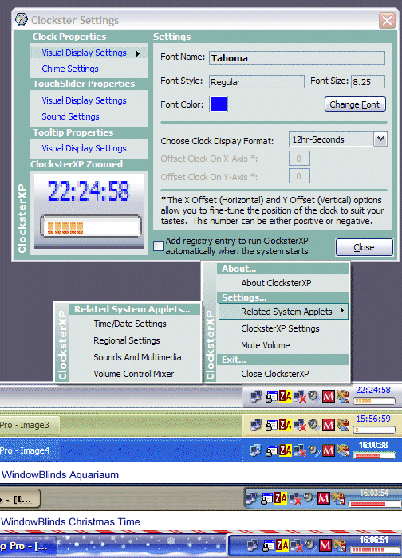



## Clockster XP\.\.\.\.Almost There

### Description

Updated 8 March. Added the ability to cycle through the menu options on the settings form using the enter key and the up/down arrow keys. Only works when at least one item has the focus which is always the case when the form loads. Also, removed X offset property and implemented Y offset so you can adjust the vertical position of the clock and Volume slider. Also added the ability to adjust the height of the Volume slider. Just didn't need the x property because the control automatically centers on the X axis. As for the Y axis, I wanted to give the user absolute control over placement so I added Carles P.V.'s updown control, with his permission of course, to allow the user to position the clock/slider where they want. They can even be reversed and you can put the slider on top and the clock on the bottom if you want. I also added sound and the tooltip when using the mousewheel to adjust the volume. Still implementing some validation and error handling so don't get too extreme with adjusting the volume slider's height. Also working on some bullet-proof error handling and the addition of date/day display. Keep the suggestions coming...
 
### More Info
 

             |
---                |---
**Submitted On**   |2005-03-08 20:00:54
**By**             |[AlT](https://github.com/Planet-Source-Code/PSCIndex/blob/master/ByAuthor/alt.md)
**Level**          |Intermediate
**User Rating**    |4.8 (48 globes from 10 users)
**Compatibility**  |VB 6\.0
**Category**       |[Complete Applications](https://github.com/Planet-Source-Code/PSCIndex/blob/master/ByCategory/complete-applications__1-27.md)
**World**          |[Visual Basic](https://github.com/Planet-Source-Code/PSCIndex/blob/master/ByWorld/visual-basic.md)
**Archive File**   |[Clockster\_186289382005\.zip](https://github.com/Planet-Source-Code/alt-clockster-xp-almost-there__1-59312/archive/master.zip)

